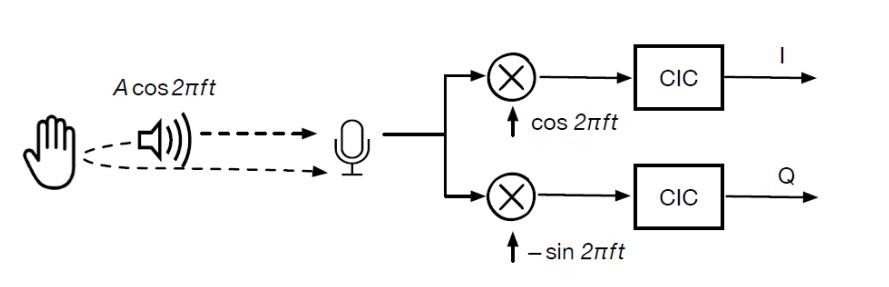
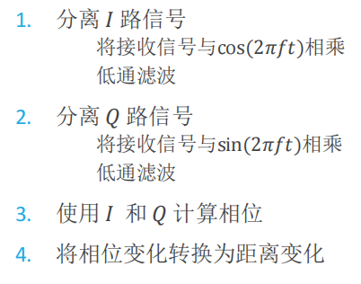

# project1VD
human deceted sensor by voice
- this folder contains above files 
```
AIOTproject1
    |
    |
    |___configure
    |            |
    |            |config.sh
    |___start.py
    |
    |___audio
    |        |
    |        |___test.wav
    |        |
    |        |___output.wav
    |
    |___readme

```

- [project1VD](#project1vd)
  - [Environment](#environment)
    - [Hardware](#hardware)
  - [Usage](#usage)
  - [Theory](#theory)
  - [Disadvantages and improvements](#disadvantages-and-improvements)
## Environment
### Hardware
* terminal os (here use Raspberry Pi 4B)
* ReSpeaker 6-Mic(sampling rate is at least 48000,here is seeed)
* Speaker（ at least 20000Hz sound waves,here is PHILIPS SPA20/93）

## Usage
```bash
sh config.sh
```
```python
python3 start.py
```


## Theory
Phase-based distance tracking
Refer to Device-Free Gesture Tracking Using Acoustic Signals.pdf


## Disadvantages and improvements
parameter
- dtype=int16 若为32会出现大量噪声和失真
